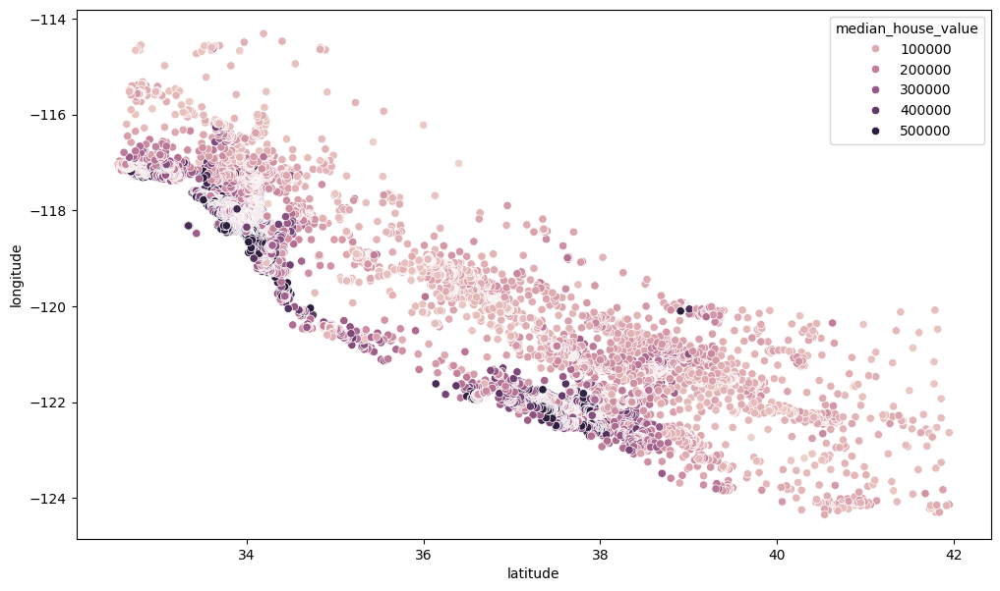
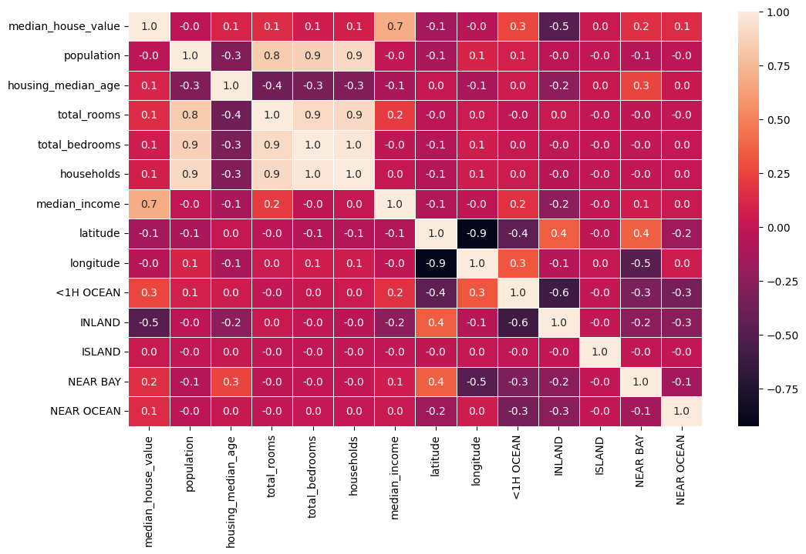
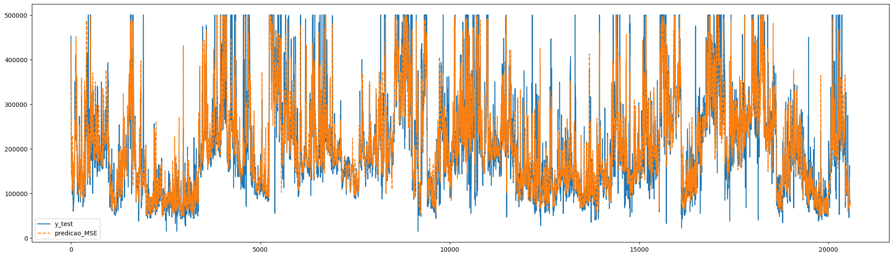

# Desafio_01_BRAIN

# Objetivo:
O desafio 1 proposto pelo BRAIN consiste no desenvolvimento  e treinamento de um modelo de IA com base no DataFrame "housing.csv", sendo o objetivo desta, realizar a previsão da média de preço das casas da parcela de uma determinada população. Para isto o projeto foi dividido em 2 etapas.

# Etapa I - Tratamento de dados
Foi realizado uma preparação dos dados do DataFrame para que o modelo de IA possa ter um processo de aprendizagem mais limpo, para isso foi necessário a realização de algumas sub-etapas.

## Transformação de dados categóricos:
O modelo de IA em questão não consegue fazer a diferenciação de categorias (strings), sendo necessário fazer uma conversão desssas para dados numéricos, no caso binários, isto foi feito através do método 'One hot enconding', que realiza a adição de novas features para cada categoria presente, determinando o valor 1(TRUE) quando presente, do contrário define 0 (FALSE) para ausente.  Desta forma nosso modelo consegue diferenciar entre as categorias

Na imagem abaixo, temos a presença da quantidade de casos para cada categoria, podemos observar que ISLAND possui apenas 5 casos, apesar da IA apresentar um ganho de 0,01% com a ausência da feature, foi optado por manter a mesma, isto porque acredita-se que a IA terá uma melhor precisão para um caso em questão.

## Tramento de Valores nulos:
A presença de dados faltantes em um DataFrame podem influenciar negativamente no precesso de aprendizagem do modelo, para isto é necessario fazer a substituição desses valores ou remoção dos mesmos. Neste caso em questão foi optado por realizar a substituição desses valores pela mediana dos demais da mesma feature (poderia ser feita a substiuição pela média, mas não foi, devido a presença de uma alta variação na faixa de números)

## Tratamento de Outliers:
Outliers são valores atípicos que fogem de uma determinada faixa interquartil, estes valores podem ajudar ou não no treinamento do modelo, neste caso foi determinado que o modelo apresentava um melhor desempenho com a remoção dos outliers mais isolados dos demais.

Gráfico pré-tratamento:

Gráfico pós-tratamento:

## Análise de dados:
Cosiste na seleção das features que serão usadas para o treinamento do modelo, esta é feita com base na análise de gráfica e dos dados obtidos atráves da etapa anterior em conjunto com o julgamento do desenvolvedor. Diversos gráficos foram feitos nesta etapa, porém foi mantido apenas aqueles que foram julgados utéis para seleção das features.

O gráfico abaixo foi utilizado para verificar se há uma relação da localização (longitude-latitude) com o valor médio da casa.

O diagrama abaixo demonstra a correlação da nossa coluna target com as demais features.

## Seleção das features:
### Features Mantidas:
  - Longitude / latitude: Assim como mostrado pelo gráfico de dispersão feito na etapa de visualização de dados, a localização de uma casa pode valorizar/desvalorizar o valor da mesma;

  - Total_rooms: Uma casa normalmente tende a ter um maior valor comercial a depender da quantidade de comôdos que a mesma possui;

  - Population: A depender do tamanho da população de um lugar, a busca por imóveis pode variar, influenciando o preço dos imoveis locais pela lei de oferta e demanda;

  - Households: O tamanho de uma família implica em algumas necessidades, como possivelmente uma casa com mais/menos cômodos;

  - Median_income: Quanto maior a condição financeira de uma pessoa, maior a capacidade de aquisição de bens da mesma;    

  - <1H OCEAN, INLAND, ISLAND, NEAR BAY, NEAR OCEAN: a localização de uma casa tem influência direta em sua valorização no mercado;            

### Features retiradas:
  - Housing_median_age (no caso do DataFrame fornecido, não tem como diferenciar entre uma casa antiga bem valorizada (por ser bem construída,possuir patrimônios históricos, etc) e uma mal valorizada (por estar mal conservada, construída, etc). Uma casa ser antiga não implica que ela é necessariamente pouco valorizada, assim como ser nova não significa ser bem valorizada, outros fatores devem ser levados em conta;

  - Total_bedrooms: Apesar de incialmente acreditar ser uma feature relevante, a IA apresentou um melhor desempenho sem a presença deste fator, creio que possa ser devido a redundância de dados em relação a Total_rooms ; ****

  - Groups_population: Grupos divisão de divisão de "population";

  - Groups_total_bedrooms: Grupos de divisão de "total_bedrooms";

### Target:
  - Median_house_value.

# Etapa II - Desenvolvimento e treinamento do modelo:
## Treinamento da IA:
Com as features selecionadas e com a utilização da biblioteca sklearn foi realizado o treinamento do modelo de 2 formas. A ideia inicial do desafio era projetar uma IA utilizando o modelo de regressão linear, mas após a finalização do treinamento o modelo não apresentou um resultado satisfatório, com uma taxa de acertividade de  aproximadamente 66% Com isto em mente foi buscado meio alternativos para realização do treinamento, após algumas pesquisas foi optado pela utilização do método 'randon forest regressor' o qual atingiu uma taxa de acertividade satisfatória, sendo de 82.63%.

Abaixo apresenta-se um gráfico de previsão do modelo treinado com o metodo 'random forest regressor'.
